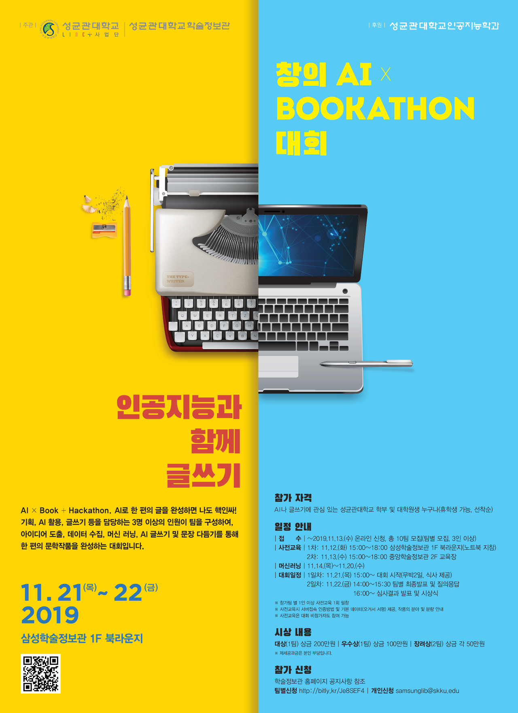

# AI x Bookathon
#### ELC39팀 ([정민정](https://github.com/jeina7), [김형준](https://github.com/khj68), [김승태](https://github.com/kim-seungtae))

성균관대학교와 인공지능을 개발하는 기업 마인즈랩이 함께 협약을 맺고 2019년 11월 21-22일 주최한 [AI x Bookathon] 행사에서 ELC39팀이 사용한 소스코드 레포입니다.
대회의 내용은 지난 2월 OpenAI에서 발표한 GPT-2 모델을 학습시켜 하나의 수필 작품을 완성해내는 프로젝트로, 더 자세한 내용은 [블로그](https://jeinalog.tistory.com/entry/AI-x-Bookathon-%EC%9D%B8%EA%B3%B5%EC%A7%80%EB%8A%A5%EC%9D%84-%EC%88%98%ED%95%84-%EC%9E%91%EA%B0%80%EB%A1%9C-%ED%95%99%EC%8A%B5%EC%8B%9C%EC%BC%9C%EB%B3%B4%EC%9E%90)에서, 발표자료는 [이 곳](https://www.slideshare.net/MinjungChung1/ai-bookathon-public)에서 확인하실 수 있습니다.
